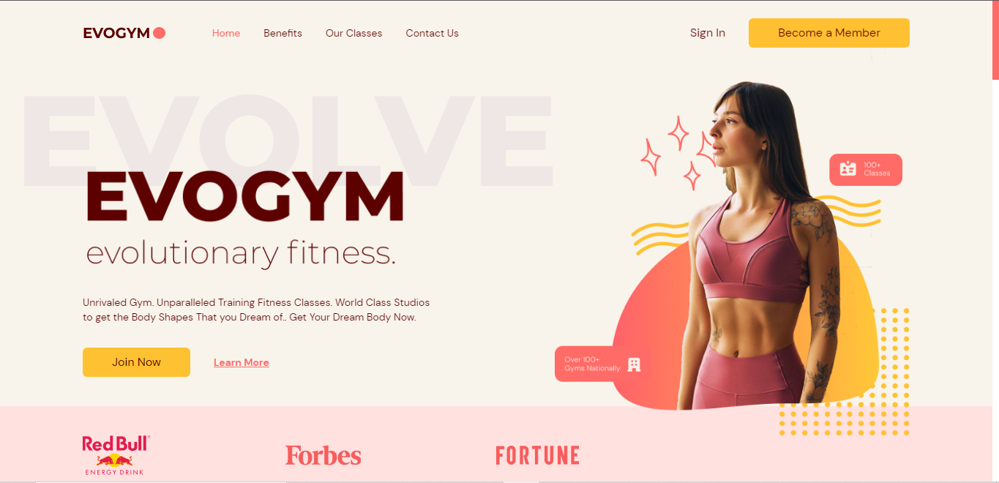

<h1 align="center">🏋️Gym app</h1>

<a href="https://gym-app-mocha.vercel.app/" target="_blank">clique para visitar o projeto</a>

<h1>💼 Tecnologias utilizadas</h1>

Para o desenvolvimento deste site utilizei as seguintes tecnologias:

<ul>
<li>React</li>
<li>React Hook Form</li>
<li>Typescript</li>
<li>Motion</li>
</ul>
